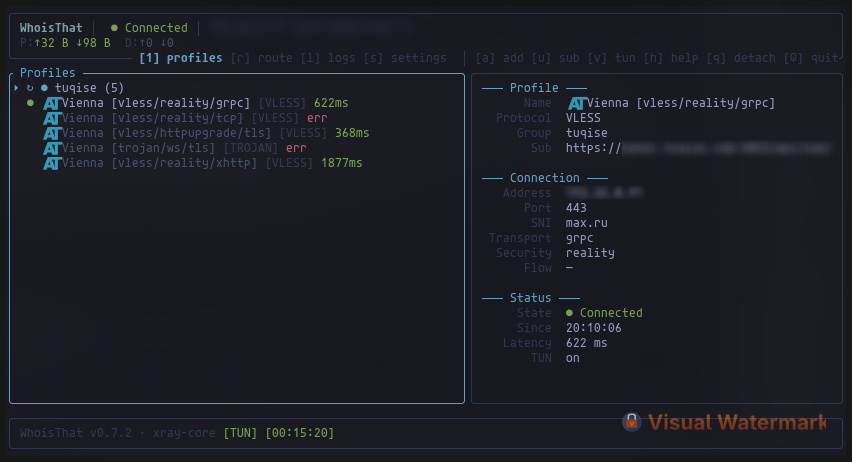

# WhoisThat

A modern terminal-based VPN client. Rust TUI frontend. Go engine backed by Xray-core.

**Supports**: VLESS with Reality, xHTTP, and gRPC. Full TUN-mode VPN. Subscription-based profile management.



---

## Installation

### Quick install (any Linux distribution)

```bash
curl -fsSL https://raw.githubusercontent.com/kvunoff/whoisthat/main/install.sh | bash
```

The script auto-detects your distro, installs Go and Rust from official channels,
builds everything from the latest tagged release, and copies binaries to `/usr/local/bin`.
Xray-core is included. tun2socks is offered as an opt-in for TUN mode.

### Arch Linux (AUR)

```bash
paru -S whoisthat
# or
yay -S whoisthat
```

### Manual build

Prerequisites: **Rust** 1.80+, **Go** 1.24+, **git**, **curl**, a C compiler.

```bash
git clone https://github.com/kvunoff/whoisthat.git
cd whoisthat

# Parser (standalone Rust binary — URI → Xray JSON)
cd parser && cargo build --release && cd ..

# Core (Go daemon — VPN engine)
cd core/core && go build -o whoisthat-core && cd ../..

# TUI (Rust — terminal interface)
cargo build --release

# Install
sudo install -Dm755 target/release/whoisthat              /usr/local/bin/whoisthat
sudo install -Dm755 core/core/whoisthat-core               /usr/local/bin/whoisthat-core
sudo install -Dm755 parser/target/release/whoisthat-parser /usr/local/bin/whoisthat-parser
```

Xray-core can be installed via `go install github.com/XTLS/Xray-core@latest`
and moved to PATH. tun2socks is only needed for TUN mode.

### Configuration

**TUI config** — `~/.config/whoisthat/config.toml`:
```toml
core_tcp_port = 4897
core_host = "127.0.0.1"
autoconnect = false
last_group_id = 0
last_profile_id = 0
show_ip = true
log_enabled = false
log_level = "warn"
test_method = "http-get"
```

**Core config** — `~/.config/whoisthat/config.json` (auto-generated):
```json
{
  "socks-port": 3090,
  "http-port": 3091,
  "core-tcp-port": 4897,
  "test-port-range": { "start": 3095, "end": 30120 },
  "dns-servers": ["1.1.1.1", "8.8.8.8"]
}
```

`dns-servers` is a list of DNS server IPs used in three contexts:
- **Profile resolution** — resolving proxy hostnames to IPs (all servers queried, results merged)
- **Xray direct outbound** — DNS servers injected into xray's config for `freedom` (direct) outbound domain resolution
- **TUN mode** — the first server in the list is used for system-wide DNS hijack via iptables DNAT rules

`socks-port` and `http-port` set the local SOCKS5/HTTP proxy ports. `test-port-range` defines the port pool for latency testing (spawns temporary xray instances).

Profile data is stored under `~/.local/share/whoisthat/db/`.

---

## Features

- **Subscription support** — add groups with subscription URLs, refresh profiles, view metadata (traffic used/limit, expiry)
- **Group management** — add, rename, edit subscription URL, delete entire groups
- Import VLESS profiles (URI, clipboard paste, or subscription refresh)
- Connect / disconnect / switch profiles
- Full system-wide TUN-mode VPN (`tun2socks` + `iptables`)
- **Profile testing** — three methods: TCP connect, HTTP GET (SOCKS5 → Cloudflare), HTTP HEAD
- **Scan-all testing** — `t` scans all profiles across all groups with dedup; `T` tests only focused profile/subscription
- **Custom routing rules** — domain, IP, protocol, port → proxy/direct/block (`r` tab)
- Real-time connection status with uplink/downlink traffic stats
- **Log viewer** — live tail from core log, auto-scroll, [WARN]/[ERRO] highlighting
- **Configurable** — DNS servers, proxy ports, log level, test method via settings and config files
- **Detach/reattach** — `q` leaves VPN running in background, reopen TUI to reattach
- Autoconnect on startup
- Public IP display (auto-refreshed every 30s and on connect/disconnect/TUN-toggle)
- Dark color scheme (Tokyo Night inspired)
- Keyboard-driven — mouse is optional

---

## Architecture

```
┌──────────────────────────────┐
│  WhoisThat (Rust TUI)        │  ratatui + crossterm
│  ⋅ Profiles ⋅ Logs ⋅ Settings│
└──────────┬───────────────────┘
           │  TCP / JSON
           │  4-byte big-endian length prefix + JSON payload
           │  localhost:4897
           ▼
┌──────────────────────────────┐
│  WhoisThat Core (Go daemon)  │
│  ⋅ Profile DB (JSON files)   │
│  ⋅ Proxy manager             │
│  ⋅ TUN manager               │
│  ⋅ TCP server (commands)     │
└──────────┬───────────────────┘
           │  subprocess (stdin JSON config)
           ▼
┌──────────────────────────────┐
│  Xray-core                   │
│  ⋅ VLESS / Reality / gRPC    │
│  ⋅ xHTTP inbound             │
│  ⋅ SOCKS5 / HTTP outbound    │
└──────────┬───────────────────┘
           │
     ┌─────┴─────┐
     ▼           ▼
  TUN device   DNS routing
  (tun2socks)  (iptables)
```

### How it works

1. **WhoisThat Core** is a long-running Go daemon. It manages VPN profiles (stored as JSON files under `~/.local/share/whoisthat/db/`), launches Xray-core as a subprocess, and controls the TUN device via `iproute2` + `tun2socks`.

2. **Xray-core** handles all protocol-level work: VLESS handshake, Reality authentication, xHTTP/gRPC transport, SOCKS5 local proxy. Its JSON config is generated on-the-fly from profile URIs by the bundled `whoisthat-parser`.

3. **TUN mode** creates a virtual network interface (`whoisthattun`), sets up `iptables` rules (DNS hijack, MASQUERADE), and routes all system traffic through the Xray SOCKS5 proxy via `tun2socks`.

4. **WhoisThat TUI** (this Rust binary) connects to the core over TCP on `127.0.0.1:4897`. It sends commands and receives asynchronous notifications. The TUI never touches networking directly — all VPN logic lives in the core.

### Routing rules

Custom routing rules (domain, IP, protocol, port) can redirect traffic to `proxy`, `direct`, or `block` outbounds. Rules are stored in `~/.local/share/whoisthat/db/routing.json` and injected into xray's JSON config on every connect.

**Proxy mode (SOCKS5):**
- DNS queries (UDP port 53) always go through `proxy` — this prevents user domain rules from interfering with DNS resolution
- Matched traffic follows the user's rule; unmatched traffic implicitly falls back to `proxy` (first outbound)
- `direct` rules work correctly: xray resolves the domain via its internal DNS (through proxy), then connects directly via the `freedom` outbound

**TUN mode:**
- The TUN default route sends ALL system traffic through `tun2socks` → SOCKS5 → xray. Without special handling, xray's own `freedom` outbound traffic would loop back into TUN
- Xray runs under a **dedicated UID** (auto-picked from 61000+ range). The core configures `ip rule uidrange <xray_uid> lookup 100` and routes table 100 through the physical gateway, bypassing TUN
- User applications retain their normal UID and stay under TUN routing
- This ensures `freedom` (direct) outbound connections from xray bypass TUN while all user traffic stays protected

---

## TCP API Protocol

### Wire format

```
┌──────────────┬───────────────────────────┐
│ 4 bytes (BE) │ JSON payload              │
│ uint32 len   │ {"msg":"...","data":{...}}│
└──────────────┴───────────────────────────┘
```

Both client→core commands and core→client notifications use the same framing. The core broadcasts notifications to all connected clients.

### Commands (Client → Core)

| Message | Data | Response |
|---|---|---|
| `get-application-state` | `{}` | `application-state` |
| `connect` | `{"profile":{"id":int,"group_id":int}}` | `status-changed` |
| `disconnect` | `{}` | `status-changed` |
| `add-profiles` | `{"uris":"...","group_id":int}` | `profiles-added` |
| `delete-profiles` | `{"profiles":[{"id":int,"group_id":int}]}` | `profiles-deleted` |
| `test-profile` | `{"profile":{"id":int,"group_id":int},"method":"str"}` | `profile-updated` |
| `enable-tun` | `{}` | `tun-status-changed` |
| `disable-tun` | `{}` | `tun-status-changed` |
| `is-root` | `{}` | `is-root-answer` |
| `update-profile` | `{"Profile":{"id":int,"group_id":int},"Name":"str"}` | `profile-updated` |
| `update-group` | `{"id":int,"name":"str","subscription_url":"str"}` | `group-updated` |
| `add-group` | `{"name":"str","subscription_url":"str"}` | `group-added` |
| `delete-group` | `{"id":int}` | `group-deleted` |
| `update-subscription` | `{"group_id":int}` | `subscription-updated` |
| `die` | `{}` | (stops core) |

### Notifications (Core → All Clients)

| Message | Data |
|---|---|
| `application-state` | Full state: groups, profiles, connection status, TUN status |
| `status-changed` | `{"connection":"connected"\|"disconnected","profile":{...}}` |
| `profiles-added` | `{"profiles":[...]}` |
| `profiles-deleted` | `{"deleted-profiles":[...]}` |
| `profile-updated` | `{"profile":{...}}` (also fires on test result) |
| `group-added` | `{"id":int,"name":"str","subscription_url":"str"}` |
| `group-deleted` | `{"id":int}` |
| `group-updated` | `{"id":int,"name":"str",...}` (full Group object) |
| `subscription-updated` | `{"group_id":int,"group":{...},"profiles":[...]}` |
| `tun-status-changed` | `{"is_enabled":bool}` |
| `is-root-answer` | `{"IsRoot":bool}` |
| `traffic-stats` | `{"proxy_up":int,"proxy_down":int,"direct_up":int,"direct_down":int}` |
| `warn` | `{"key":"str","content":"str"}` |

### Profile structure
```json
{
  "id": 1,
  "group_id": 0,
  "nano-id": "abc123",
  "name": "My Server",
  "protocol": "vless",
  "uri": "vless://...",
  "address": "1.2.3.4",
  "host": "example.com",
  "test-result": 45
}
```
`test-result`: `>0` = latency in ms, `-1` = failed, `-2` = testing, `0` = untested.

### Group structure
```json
{
  "id": 1,
  "name": "My Sub",
  "subscription_url": "https://...",
  "last_id": 42,
  "sub_last_updated": 1712345678,
  "sub_expires": 1720000000,
  "sub_upload": 1048576,
  "sub_download": 52428800,
  "sub_total": 107374182400
}
```
Subscription metadata (`sub_*`) is populated from the `subscription-userinfo` HTTP header returned by the subscription server. Fields are `omitzero` — omitted from JSON when zero.

---

## Usage

### Navigation

| Key | Action |
|---|---|
| `j` / `↓` | Move cursor down |
| `k` / `↑` | Move cursor up |
| `g` | Jump to top |
| `G` | Jump to bottom |
| `Tab` | Switch focus (list ↔ details panel) |
| `h` / `?` | Show help |

### Connection

| Key | Action |
|---|---|
| `c` / `Enter` | Connect to selected profile |
| `d` | Disconnect |
| `t` | Test all profiles (starts from cursor, top-to-bottom, dedup) |
| `T` | Test focused profile or subscription group only |
| `v` | Toggle TUN mode (requires root) |

### Profiles & Groups

| Key | Action |
|---|---|
| `a` | Import VLESS URI (clipboard or manual input) |
| `x` | Delete selected profile |
| `X` | Delete current group (with confirmation) |
| `e` | Edit group (name + subscription URL) |
| `U` | Add new group (name + subscription URL) |
| `u` | Update subscription (refresh profiles from URL) |
| `Ctrl+V` | Paste from clipboard in input popups |

### Tabs & Quit

| Key | Action |
|---|---|
| `l` | Logs view (live tail with auto-scroll) |
| `r` | Routing rules (domain/IP/protocol/port → proxy/direct/block) |
| `s` | Settings |
| `Esc` / `1` | Back to Profiles |
| `q` | Detach TUI (VPN stays connected in background) |
| `Q` / `Ctrl+C` | Full quit (stop VPN + exit) |

### Settings

| Setting | Values | Description |
|---|---|---|
| Autoconnect | on/off | Automatically connect to last used profile on startup |
| Show IP | on/off | Display public IP in top bar |
| TUI log | on/off | Enable Rust TUI debug log (writes to `~/.local/share/whoisthat/tui.log`) |
| Log level | error/warn/info/debug/trace | Minimum log level for both TUI and core |
| Test method | tcp/http-get/http-head | Latency test method (tcp = direct dial, http = via SOCKS5 proxy) |

Navigate with `j`/`k`, toggle booleans with `Space`/`Enter`, cycle values with `h`/`l`.

### TUN Mode

TUN mode requires root privileges. The core creates a `whoisthattun` virtual interface, configures `iptables` rules, and routes all traffic through the VPN. DNS queries are redirected to the first server in `dns-servers` config.

Run with: `sudo -E whoisthat`

The `-E` flag is **required** — without it the environment is not preserved and the core cannot find your config, profiles, or log files. The TUI will display a warning if `-E` is missing.

### Subscription Workflow

1. Press `U` to add a new group — enter a name and subscription URL
2. Press `u` with the group selected to fetch and parse profiles from the URL
3. The details panel shows subscription metadata when available (traffic used, expiry, last updated)
4. Press `e` to edit the group name or subscription URL at any time
5. Press `X` to delete the entire group and its profiles

---

## File Structure

```
whoisthat/
├── Cargo.toml          ← Rust project manifest
├── src/                ← Rust TUI source
│   ├── main.rs         ← Entry point, event loop, autoconnect
│   ├── config.rs       ← Config loader (~/.config/whoisthat/config.toml)
│   ├── core_client/    ← TCP client for the Go core
│   │   ├── protocol.rs ← All serde types mirroring Go structs
│   │   ├── connection.rs ← TCP + 4-byte length framing
│   │   ├── dispatch.rs ← Read loop → typed event channel
│   │   └── commands.rs ← High-level async send functions
│   └── ui/             ← ratatui components
│       ├── app.rs      ← Main app state + rendering
│       ├── theme.rs    ← Color palette (Tokyo Night)
│       ├── settings.rs ← Settings screen
│       ├── routing.rs  ← Routing rules tab + popups
│       ├── logs.rs     ← Log viewer (live tail + auto-scroll)
│       └── widgets.rs  ← Shared widget helpers
├── install.sh          ← Universal installer script
├── parser/             ← VLESS URI → Xray JSON parser (Rust)
│   ├── Cargo.toml
│   └── src/
├── core/               ← WhoisThat Core (Go VPN engine)
│   └── core/
│       ├── main.go     ← Daemon entry point
│       ├── commands/   ← TCP command handlers
│       ├── db/         ← JSON file-based profile DB
│       ├── lib/        ← Core libraries
│       │   ├── logger/     ← Structured logger ([INFO]/[WARN]/[ERRO])
│       │   ├── TCPServer/  ← TCP server + dispatcher
│       │   ├── AppConfig/  ← Core configuration
│       │   ├── PortPool/   ← Dynamic port allocator
│       │   └── proxy/      ← Xray wrapper, TUN manager, tun2socks
│       ├── structs/    ← Shared data types
│       └── utils/      ← Binary detection, DNS resolution
└── .gitignore
```

---

## Credits

Built on ideas by [Keivan-sf](https://github.com/Keivan-sf).
Powered by [Xray-core](https://github.com/XTLS/Xray-core), [tun2socks](https://github.com/xjasonlyu/tun2socks).

---

## License

MIT — see [LICENSE](LICENSE).
